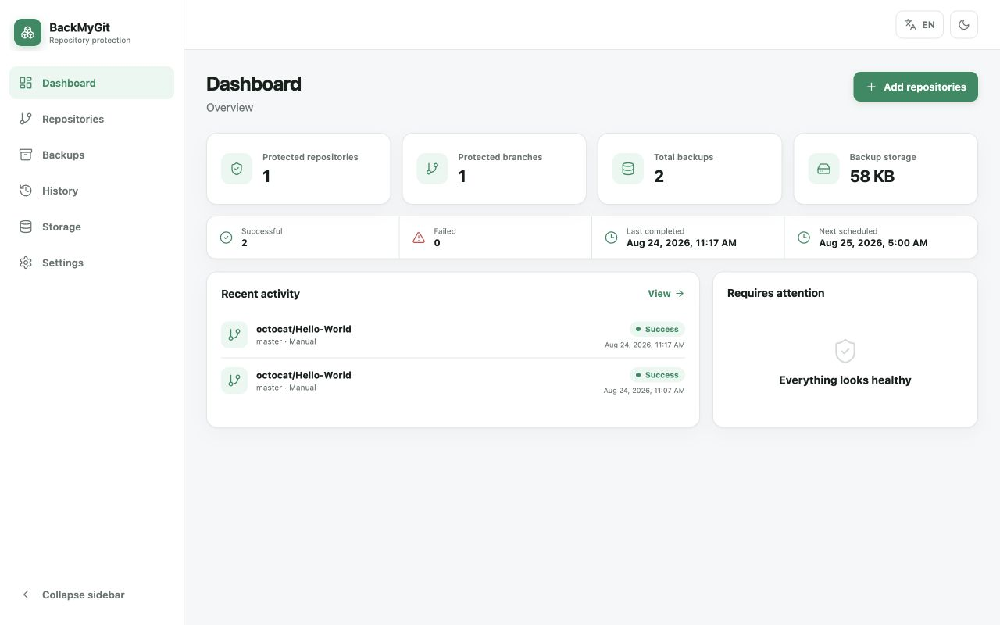
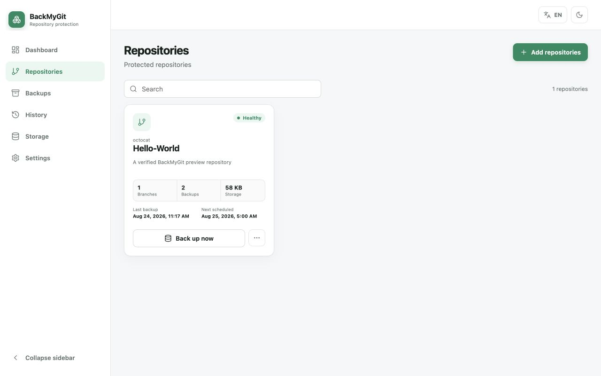
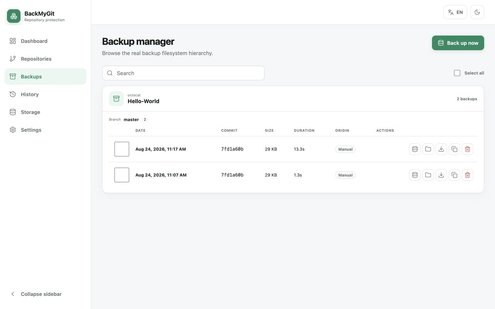
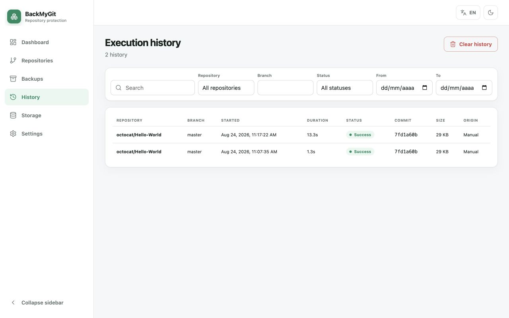
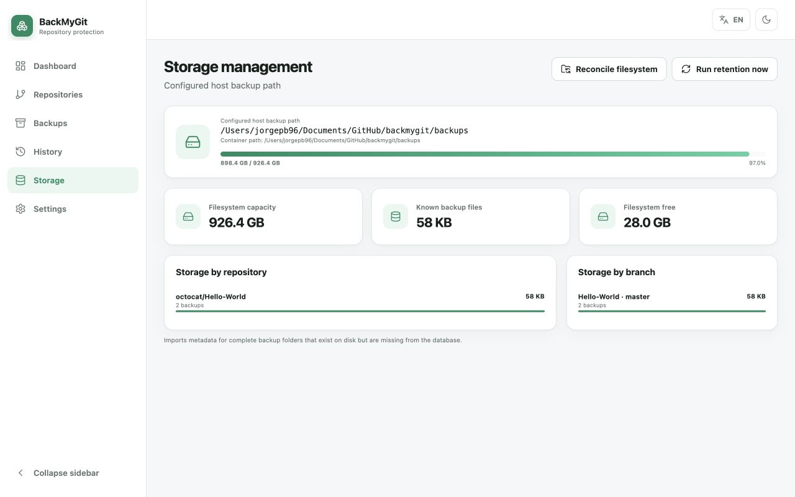
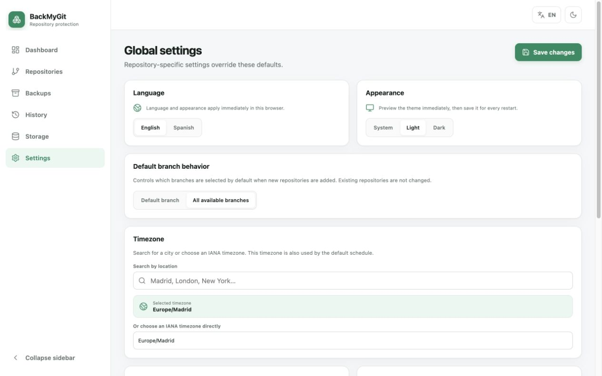

# BackMyGit

[](https://github.com/Drakonis96/backmygit/releases/latest)
[](https://hub.docker.com/r/drakonis96/backmygit)
[](LICENSE)

BackMyGit is a self-hosted GitHub backup manager with mandatory authentication and verified multi-destination replication. It creates directly accessible local Git backups and can independently copy each snapshot to Google Drive, Dropbox, OneDrive, MEGA, S3-compatible storage, or any existing rclone remote.

## Table of Contents

- [Features](#features)
- [Screenshots](#screenshots)
- [Quick start](#quick-start)
- [Configuration](#configuration)
- [Cloud destinations](#cloud-destinations)
- [Internet-facing security](#internet-facing-security)
- [Disaster recovery](#disaster-recovery)
- [Backup layout](#backup-layout)
- [Links](#links)

## Features

- Real-time public GitHub repository and branch discovery
- Atomic background backups with Git integrity checks and retry handling
- Daily, weekly, monthly, and interval schedules with location-based timezones
- Global and per-repository retention policies
- Filesystem reconciliation, backup browser, downloads, history, and storage insights
- Multiple independently retried and SHA-256-verified cloud replicas powered by rclone
- Optional client-side encryption of remote names, directories, and contents
- Managed OAuth with PKCE for Google Drive, Dropbox, and OneDrive; credentials for MEGA and S3
- Remote folder browser, queued restores, remote retention, progress, audit history, and encrypted recovery kits
- Role-based access, CSRF protection, hardened sessions, host/proxy validation, and encrypted secrets at rest
- Responsive light/dark UI in English and Spanish
- Transparent host storage: repository backups never live in a hidden Docker volume

## Screenshots

| Dashboard | Repositories |
| --- | --- |
|  |  |

| Backups | History |
| --- | --- |
|  |  |

| Storage | Settings |
| --- | --- |
|  |  |

## Quick start

Requirements: Docker Engine and Docker Compose v2.

```bash
git clone https://github.com/Drakonis96/backmygit.git
cd backmygit
cp .env.example .env
```

Set an absolute, writable backup directory in `.env`:

```env
BACKUP_HOST_PATH=/mnt/storage/github-backups
```

Then start BackMyGit and open [http://localhost:8787](http://localhost:8787):

```bash
mkdir -p /mnt/storage/github-backups
sudo chown -R 1000:1000 /mnt/storage/github-backups
docker compose up -d
```

On first start, retrieve the one-time setup token and create the administrator in the web interface:

```bash
docker compose exec app cat /data/bootstrap-token
```

The host port binds to `127.0.0.1` by default. For an Internet-facing deployment, terminate TLS at a trusted reverse proxy and configure `PUBLIC_URL`, `ALLOWED_HOSTS`, `TRUSTED_PROXIES`, and `FORCE_HTTPS=true`. Never expose the application over plain HTTP.

## Configuration

| Variable | Default | Purpose |
| --- | --- | --- |
| `BACKUP_HOST_PATH` | required | Host directory bind-mounted at `/backups` |
| `BACKMYGIT_IMAGE` | `drakonis96/backmygit:v0.2.0` | Published image to run |
| `APP_PORT` | `8787` | Web interface port |
| `APP_BIND_ADDRESS` | `127.0.0.1` | Host interface used for the published port |
| `PUBLIC_URL` | empty | Canonical external HTTPS origin used for security checks and OAuth |
| `ALLOWED_HOSTS` | empty | Additional comma-separated accepted HTTP hosts |
| `TRUSTED_PROXIES` | empty | Exact comma-separated proxy IPs or CIDRs trusted for forwarded headers |
| `FORCE_HTTPS` | `false` | Redirect safe requests and reject unsafe requests received without HTTPS |
| `SESSION_IDLE_MS` | `1800000` | Authenticated session inactivity timeout |
| `SESSION_ABSOLUTE_MS` | `43200000` | Maximum authenticated session lifetime |
| `WORKER_CONCURRENCY` | `2` | Concurrent jobs for different branches |
| `TRANSFER_CONCURRENCY` | `2` | Concurrent rclone upload, restore, and deletion jobs |
| `TRANSFER_MAX_ATTEMPTS` | `5` | Attempts before a cloud transfer requires manual retry |
| `RCLONE_TIMEOUT_MS` | `3600000` | Timeout for one rclone operation |
| `MIN_FREE_BYTES` | `536870912` | Free-space safety threshold |
| `GIT_TIMEOUT_MS` | `1800000` | Git command timeout in milliseconds |
| `APP_VERSION` | `0.2.0` | Version stored in backup metadata |

Application state, the SQLite database, and the automatically generated master key are stored in the `app-data` volume. Actual backups are stored only in `BACKUP_HOST_PATH`. The image runs as UID/GID 1000, with all Linux capabilities dropped and a read-only root filesystem; the backup directory must therefore be writable by UID 1000.

## Cloud destinations

Open **Destinations**, add one or more connections, test them, browse to a remote folder, and create a destination. Client-side encryption is enabled by default. Select every destination that should receive future snapshots and save the assignment. Uploads are fan-out jobs: a failure in one provider does not invalidate the local backup or another provider's replica.

Google Drive, Dropbox, and OneDrive use your own provider OAuth application. Set `PUBLIC_URL` first and copy the exact callback URI shown by BackMyGit into the provider console. Authorization uses a ten-minute, single-use state tied to the current user and session plus PKCE S256. MEGA and S3 credentials are entered directly. Existing rclone remotes use `/config/rclone/rclone.conf`; add a read-only bind mount for that file to both services if needed.

Remote archives are uploaded through a temporary name, verified by downloading their SHA-256 through rclone, and only then published. Retention queues remote deletion separately. Removing only the local copy leaves a verified remote replica recoverable from the Destinations screen.

## Internet-facing security

Keep `APP_BIND_ADDRESS=127.0.0.1` unless a private Docker network requires another binding. Put BackMyGit behind a TLS reverse proxy, set the exact external `PUBLIC_URL`, enable `FORCE_HTTPS=true`, and trust only the proxy IP or CIDR in `TRUSTED_PROXIES`. Do not use a broad trust value such as `0.0.0.0/0`. `ALLOWED_HOSTS` is only needed for additional legitimate hostnames.

The proxy must preserve `Host` and set `X-Forwarded-Proto: https`; it must not expose the worker container. Add independent access controls, rate limits, and backups of both `/data` and `BACKUP_HOST_PATH`. See [the security and reverse-proxy guide](docs/SECURITY.md) for a complete checklist and Nginx example.

## Disaster recovery

The application encrypts managed provider tokens and rclone crypt keys with `/data/master.key`. Back up the entire `/data` volume; the database without this key cannot decrypt those secrets. In **Destinations**, also create a passphrase-encrypted recovery kit and store the file separately from its passphrase.

To decrypt a kit on a trusted machine:

```bash
BACKMYGIT_RECOVERY_PASSPHRASE='your long passphrase' \
  node scripts/decrypt-recovery-kit.mjs backmygit-recovery-YYYY-MM-DD.json recovered.json
```

The output is created with mode `0600` and contains sensitive material. Delete it securely after reconstructing the required rclone remotes. Test restores periodically; a successful upload is not a substitute for a restore drill.

## Backup layout

Every successful run creates a usable Git working copy with its `.git` directory and a `backup-metadata.json` file:

```text
BACKUP_HOST_PATH/
└── owner_repository/
    └── branch/
        └── YYYY-MM-DD_HH-mm-ss/
            ├── .git/
            ├── repository files…
            └── backup-metadata.json
```

Branch path separators are normalized safely; the exact original branch is preserved in metadata. Work is prepared under `/backups/.tmp` and moved into place only after verification.

## Links

- [Documentation](https://github.com/Drakonis96/backmygit#readme)
- [Releases](https://github.com/Drakonis96/backmygit/releases)
- [Docker Hub](https://hub.docker.com/r/drakonis96/backmygit)
- [Issues](https://github.com/Drakonis96/backmygit/issues)
- [License](LICENSE)

Location search uses the [Open-Meteo Geocoding API](https://open-meteo.com/en/docs/geocoding-api).
